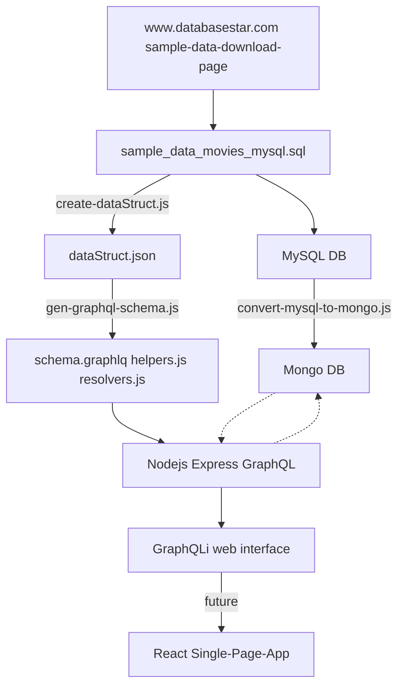

<div id="top"></div>
<!--
Later...
https://github.com/othneildrew/Best-README-Template
-->

<h2 align="center">Central Arkansas JavaScript.com</h2>

<p align="center">

</p>

<h3 align="center">Using GraphQL with MongoDB</h3>
<h3 align="center">December 16, 2021</h3>

---


__Martin Jackson__

__Email:__ martin.a.jackson@gmail.com

__Twitter:__ <a href="https://twitter.com/martin_jackso"> @martin_jackso</a>

---


---
### I am using Mermaid Graphs in this Markdown, you will need the following Google Chrome plugin to see the graphs.

Chrome: https://chrome.google.com/webstore/detail/github-%20-mermaid/goiiopgdnkogdbjmncgedmgpoajilohe?hl=en

---

https://www.databasestar.com/sample-data-download-page



`node ` [convert-mysql-to-mongo.js](./code/convert-mysql-to-mongo.js)


```bash
#!/bin/bash

node create-dataStruct.js --in ../sample_data_movies_mysql.sql --out data/dataStruct.json
echo "--------------------"
node gen-graphql-schema.js --in data/dataStruct.json --schema movies --directory data
echo "--------------------"
```
